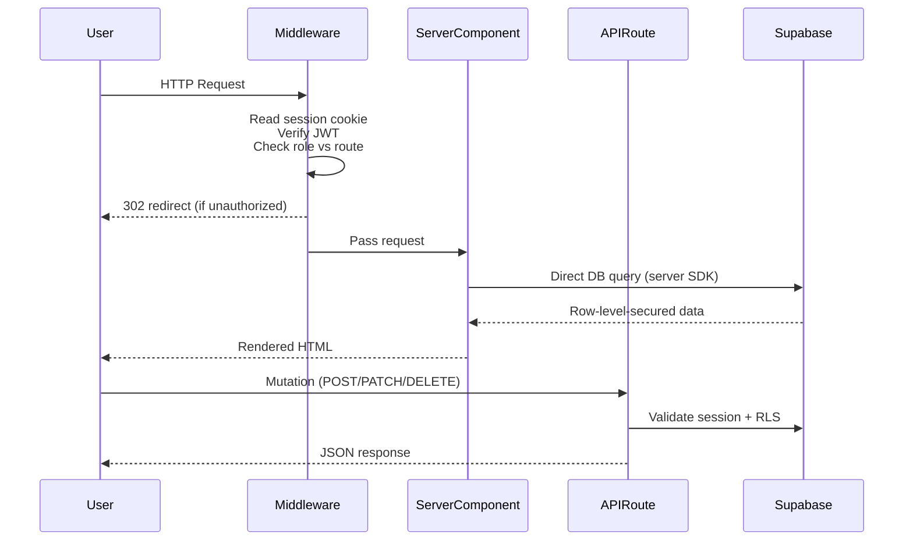
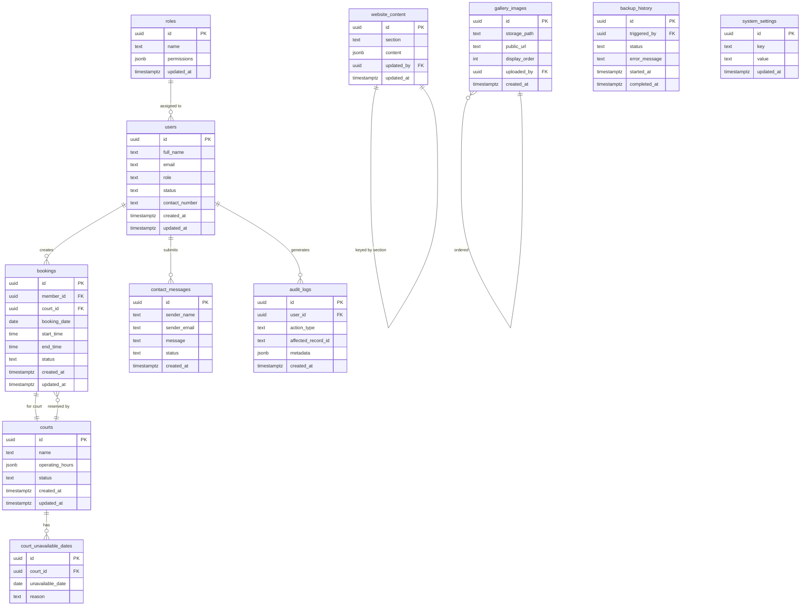
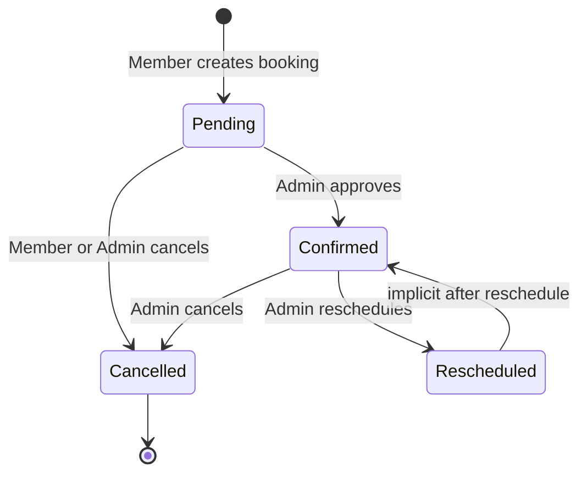

# Design Document: Sky Court Website MVP

## Overview

Sky Court is a pickleball court booking platform built as a Next.js 16 / React 19 full-stack application. The MVP delivers public-facing marketing pages, a court booking flow, member self-service features, an admin panel, and a super admin panel — all backed by Supabase (PostgreSQL + Auth + Storage) and deployed to Vercel.

The design follows a server-component-first architecture: public pages and dashboards use Next.js App Router server components for SEO and performance, while interactive booking flows and forms use client components with React Hook Form + Zod validation. API routes (Next.js Route Handlers) serve as the backend layer, with row-level security (RLS) policies enforced at the Supabase layer as a second line of defense.

### Key Design Goals

- **Role enforcement at every layer** — middleware, server components, and API routes all check the user's role before serving data or executing mutations.
- **Optimistic availability** — time-slot availability is rechecked server-side at booking creation to prevent double-bookings even when two members act simultaneously.
- **Content-driven public pages** — all editable copy is stored in `website_content` records so admins can update the site without code changes.
- **Minimal client JavaScript** — pages that are read-only (home, locate, contact) are server-rendered; client components are scoped to interactive forms and real-time UI.

---

## Architecture

### High-Level Diagram

```mermaid
graph TD
  Browser -->|HTTPS| Vercel[Vercel Edge Network]
  Vercel --> NextApp[Next.js App Router<br/>(Server Components + API Routes)]
  NextApp -->|Supabase JS Client| Supabase[(Supabase<br/>PostgreSQL + Auth + Storage)]
  NextApp -->|Supabase Admin SDK| Supabase
  Vercel -->|Static Assets| CDN[Vercel CDN]
  Supabase -->|Email| SMTP[Supabase Email / SMTP]
```

### Request Flow



### Technology Choices

| Concern | Choice | Rationale |
|---|---|---|
| Framework | Next.js 16 App Router | SSR, RSC, API Routes, file-based routing |
| UI | Material UI v6 (green theme) | Component library; matches design brief |
| Forms | React Hook Form + Zod | Declarative validation; schema reuse server/client |
| Auth | Supabase Auth | JWT sessions, email verification, password reset |
| Database | Supabase PostgreSQL | RLS, real-time, managed hosting |
| Storage | Supabase Storage | Gallery image upload/hosting |
| Deployment | Vercel | Edge CDN, serverless functions, CI/CD |
| Reports | xlsx + jsPDF | XLSX and PDF export |
| Email | Supabase SMTP (transactional) | Booking confirmations, verification |

---

## Components and Interfaces

### Application Layer Structure

```
src/
├── app/
│   ├── (public)/                  # Public marketing pages
│   │   ├── page.tsx               # Home
│   │   ├── locate/page.tsx
│   │   ├── contact/page.tsx
│   │   ├── auth/
│   │   │   ├── login/page.tsx
│   │   │   ├── register/page.tsx
│   │   │   └── forgot-password/page.tsx
│   ├── (member)/                  # Protected: role=member
│   │   ├── dashboard/page.tsx
│   │   ├── bookings/
│   │   │   ├── new/page.tsx       # Booking flow
│   │   │   └── [id]/page.tsx
│   │   └── profile/page.tsx
│   ├── (admin)/                   # Protected: role=admin|super_admin
│   │   ├── admin/
│   │   │   ├── dashboard/page.tsx
│   │   │   ├── bookings/page.tsx
│   │   │   ├── courts/page.tsx
│   │   │   ├── website/page.tsx
│   │   │   ├── gallery/page.tsx
│   │   │   ├── users/page.tsx
│   │   │   ├── reports/page.tsx
│   │   │   ├── messages/page.tsx
│   │   │   └── settings/page.tsx
│   │   └── superadmin/            # Protected: role=super_admin
│   │       ├── admins/page.tsx
│   │       ├── roles/page.tsx
│   │       ├── audit-logs/page.tsx
│   │       ├── backup/page.tsx
│   │       └── website-settings/page.tsx
│   └── api/                       # Route Handlers
│       ├── auth/[...supabase]/
│       ├── bookings/
│       ├── courts/
│       ├── contact/
│       ├── content/
│       ├── gallery/
│       ├── users/
│       ├── reports/
│       ├── audit-logs/
│       └── backup/
├── components/
│   ├── layout/                    # Navbar, Sidebar, Footer
│   ├── booking/                   # BookingFlow, SlotPicker, etc.
│   ├── admin/                     # DataTable, StatCard, ActivityFeed
│   ├── forms/                     # Reusable form components
│   └── ui/                        # MUI theme wrappers
├── lib/
│   ├── supabase/
│   │   ├── server.ts              # Server-side Supabase client
│   │   ├── client.ts              # Browser Supabase client
│   │   └── admin.ts               # Service-role client (API routes only)
│   ├── auth/
│   │   └── middleware.ts
│   ├── validation/                # Zod schemas shared across client/server
│   └── utils/
└── middleware.ts                  # Edge middleware for route protection
```

### Key Components

#### `middleware.ts` (Edge Middleware)

Runs on every request. Reads the Supabase session from the request cookie, decodes the JWT role claim, and enforces the following rules:

- `/member/*` → requires `role IN (member, admin, super_admin)`
- `/admin/*` → requires `role IN (admin, super_admin)`
- `/superadmin/*` → requires `role = super_admin`
- Unauthenticated → redirect to `/auth/login`
- Wrong role → redirect to `/403`

#### `BookingFlow` (Client Component)

A multi-step wizard managing local state:

1. **DatePicker** — calendar; disables past dates and court unavailable dates
2. **CourtSelector** — lists courts with `status = 'available'`
3. **SlotPicker** — fetches available slots via `GET /api/bookings/slots?courtId=&date=`
4. **ConfirmStep** — summary + submit → `POST /api/bookings`

Slot data is fetched fresh at each step transition. The confirmation step re-validates on the server before creating the booking record to handle race conditions.

#### `AdminSidebar` (Server Component)

Renders navigation links based on the current user's role. Super admin links render only when `role = super_admin`.

#### `WebsiteContentEditor` (Client Component)

A form-per-section editor that loads current content from `GET /api/content/:section` and submits via `PATCH /api/content/:section`. Changes are reflected on the public site on next page load (no cache beyond ISR revalidation).

---

## Data Models

### Entity Relationship Diagram



### Booking Status State Machine



### User Roles

| Role | Value stored in `users.role` | Access Level |
|---|---|---|
| Guest | — (not in DB) | Public pages only |
| Member | `member` | Member dashboard + booking |
| Admin | `admin` | Admin panel (excl. super admin pages) |
| Super Admin | `super_admin` | Full access |

### `operating_hours` JSON Schema

```json
{
  "monday": { "open": "08:00", "close": "22:00" },
  "tuesday": { "open": "08:00", "close": "22:00" },
  ...
  "sunday": { "open": "08:00", "close": "20:00" }
}
```

### `website_content.content` JSON Schema (by section)

Each row in `website_content` has a `section` key (e.g. `"hero"`, `"about"`, `"rates"`, `"faq"`, `"contact"`, `"hours"`). The `content` JSONB column stores section-specific fields:

```json
// section = "hero"
{ "headline": "...", "subheading": "...", "cta_text": "..." }

// section = "faq"
{ "items": [{ "question": "...", "answer": "..." }] }

// section = "contact"
{ "phone": "...", "email": "...", "facebook_url": "..." }
```

---

## API Routes

### Authentication

| Method | Route | Auth | Description |
|---|---|---|---|
| POST | `/api/auth/callback` | — | Supabase PKCE callback |
| POST | `/api/auth/logout` | Any | Invalidate session |

### Bookings

| Method | Route | Auth | Description |
|---|---|---|---|
| GET | `/api/bookings/slots` | member+ | Available slots for `?courtId=&date=` |
| POST | `/api/bookings` | member+ | Create booking (with conflict check) |
| GET | `/api/bookings` | member+ | Member's own bookings |
| GET | `/api/bookings/all` | admin+ | All bookings (with filters) |
| PATCH | `/api/bookings/:id` | admin+ | Approve / reschedule booking |
| DELETE | `/api/bookings/:id` | member+ | Cancel (member cancels own; admin cancels any) |

### Courts

| Method | Route | Auth | Description |
|---|---|---|---|
| GET | `/api/courts` | — | All active courts |
| POST | `/api/courts` | admin+ | Create court |
| PATCH | `/api/courts/:id` | admin+ | Update court |
| POST | `/api/courts/:id/unavailable` | admin+ | Add unavailable date |
| DELETE | `/api/courts/:id/unavailable/:dateId` | admin+ | Remove unavailable date |

### Content

| Method | Route | Auth | Description |
|---|---|---|---|
| GET | `/api/content/:section` | — | Get content for section |
| PATCH | `/api/content/:section` | admin+ | Update content for section |

### Gallery

| Method | Route | Auth | Description |
|---|---|---|---|
| GET | `/api/gallery` | — | Ordered gallery images |
| POST | `/api/gallery` | admin+ | Upload image |
| DELETE | `/api/gallery/:id` | admin+ | Delete image |
| PATCH | `/api/gallery/order` | admin+ | Reorder images |

### Users

| Method | Route | Auth | Description |
|---|---|---|---|
| GET | `/api/users` | admin+ | List members |
| PATCH | `/api/users/:id/status` | admin+ | Activate/deactivate member |
| POST | `/api/users/admin` | super_admin | Create admin account |
| PATCH | `/api/users/:id/admin-status` | super_admin | Deactivate/reactivate admin |

### Contact

| Method | Route | Auth | Description |
|---|---|---|---|
| POST | `/api/contact` | — | Submit contact message |
| GET | `/api/contact` | admin+ | List messages |
| PATCH | `/api/contact/:id` | admin+ | Mark replied / archive |

### Reports

| Method | Route | Auth | Description |
|---|---|---|---|
| GET | `/api/reports` | admin+ | Aggregated metrics `?range=daily|weekly|monthly` |
| GET | `/api/reports/export` | admin+ | XLSX or PDF `?format=xlsx|pdf&range=` |

### Audit Logs

| Method | Route | Auth | Description |
|---|---|---|---|
| GET | `/api/audit-logs` | super_admin | List logs with filters |

### Roles & Permissions

| Method | Route | Auth | Description |
|---|---|---|---|
| GET | `/api/roles` | super_admin | List roles with permissions |
| PATCH | `/api/roles/:id` | super_admin | Update role permissions |

### Backup

| Method | Route | Auth | Description |
|---|---|---|---|
| POST | `/api/backup` | super_admin | Trigger backup |
| GET | `/api/backup` | super_admin | Backup history |

### System Settings

| Method | Route | Auth | Description |
|---|---|---|---|
| GET | `/api/settings` | super_admin | Current settings |
| PATCH | `/api/settings` | super_admin | Update settings (incl. maintenance mode) |

---

## Correctness Properties

*A property is a characteristic or behavior that should hold true across all valid executions of a system — essentially, a formal statement about what the system should do. Properties serve as the bridge between human-readable specifications and machine-verifiable correctness guarantees.*

---

### Property 1: Website Content Round-Trip

*For any* set of values stored in a `website_content` record (hero headline, about text, contact details, operating hours, rates, FAQ), the corresponding public-facing page must render those exact values on the next page load.

**Validates: Requirements 1.9, 2.4, 3.7, 13.2**

---

### Property 2: Contact Form Saves Valid Submissions

*For any* valid contact form submission (non-empty name, valid email format, non-empty message), the system must create a `contact_messages` record whose `sender_name`, `sender_email`, and `message` fields exactly match the submitted values.

**Validates: Requirements 3.2**

---

### Property 3: Contact Form Rejects Invalid Inputs

*For any* contact form submission with at least one missing required field, the system must display an inline validation error for each and every missing field, and no `contact_messages` record must be created.

*For any* string that is not a syntactically valid email address, submitting it in the email field must produce an inline validation error and no record must be created.

**Validates: Requirements 3.3, 3.4**

---

### Property 4: New Registrations Default to Member Role

*For any* valid registration (unique email, password ≥ 8 characters, non-empty name), the newly created user account must be assigned `role = 'member'`.

**Validates: Requirements 4.2, 4.5**

---

### Property 5: Password Validation Rejects Short Passwords

*For any* string with fewer than 8 characters submitted as a registration password, the system must display an inline validation error on the password field and must not create a user account.

**Validates: Requirements 4.4**

---

### Property 6: Login Redirects to Role-Appropriate Dashboard

*For any* authenticated user with role `R ∈ {member, admin, super_admin}`, a successful login must redirect the user to the dashboard route designated for role `R` (member dashboard for `member`, admin panel for `admin`, admin panel for `super_admin`).

**Validates: Requirements 5.2**

---

### Property 7: Session Persistence Across Navigation

*For any* sequence of page navigations made while a valid authenticated session exists, the user's logged-in state must be preserved on every page in that sequence.

**Validates: Requirements 5.8**

---

### Property 8: Unauthenticated Users Redirected from Protected Routes

*For any* request to a protected route (member, admin, or super_admin) by an unauthenticated user, the system must redirect the request to the login page and must not serve the protected content.

**Validates: Requirements 6.1**

---

### Property 9: Role-Based Access Control Enforcement

*For any* admin- or super_admin-protected route, a request authenticated as `role = 'member'` must receive a 403 Forbidden response.

*For any* super_admin-only route, a request authenticated as `role = 'admin'` must receive a 403 Forbidden response.

This property must hold for both middleware-level routing and direct API route calls.

**Validates: Requirements 6.2, 6.3, 6.4**

---

### Property 10: Slot Availability Is Accurate

*For any* court with defined operating hours `H` and a set of existing bookings `B` on a given date, the set of time slots returned by the slot-availability endpoint must equal exactly `H \ B` — i.e., only slots within operating hours that are not already booked.

**Validates: Requirements 7.2**

---

### Property 11: Confirmed Booking Has Pending Status

*For any* valid booking confirmation (authenticated member, available court, available date and slot), the resulting `bookings` record must have `status = 'Pending'` immediately after creation.

**Validates: Requirements 7.3**

---

### Property 12: No Double-Booking of the Same Slot

*For any* two concurrent or sequential attempts to book the same court, date, and time slot, at most one booking may succeed. The second attempt — whether from the same or a different member — must be rejected with a conflict error, and the slot must not appear as available after the first booking is created.

**Validates: Requirements 7.5, 7.7**

---

### Property 13: Member Booking Dashboard Accuracy

*For any* authenticated member with a known set of bookings, the member dashboard must display all upcoming bookings in the upcoming section and all past bookings in the past section, with no omissions and no bookings belonging to other members.

*For any* booking visible on the dashboard, the detail view must contain the correct court name, date, time slot, and status.

**Validates: Requirements 8.1, 8.2, 8.3**

---

### Property 14: Cancellation Updates Status and Releases Slot

*For any* booking with status `Pending` or `Confirmed`, after a cancellation (by member or admin), the booking's status must be `Cancelled` and the previously reserved time slot must appear as available in subsequent slot-availability queries.

**Validates: Requirements 8.4, 11.3**

---

### Property 15: Profile Update Round-Trip

*For any* valid profile update (non-empty full name, optional contact number), the user record must be updated to exactly match the submitted values, and a success message must be displayed.

**Validates: Requirements 9.2**

---

### Property 16: Admin Dashboard Stats Match Database State

*For any* database state, the admin dashboard's summary cards must display counts that exactly match the aggregate query results for today's bookings, active members, and available courts.

**Validates: Requirements 10.1**

---

### Property 17: Admin Booking Approval Transition

*For any* booking with `status = 'Pending'`, admin approval must transition the status to `Confirmed`. If multiple admin actions are initiated on the same booking before the first completes, only the first action must be processed.

**Validates: Requirements 11.2**

---

### Property 18: Admin Booking Reschedule Updates Record

*For any* booking and any valid new (date, slot), admin reschedule must update the booking record to the new date and slot while preserving the booking's identity (same ID and member association).

**Validates: Requirements 11.4**

---

### Property 19: Booking Filter Results Are Correct and Complete

*For any* combination of filter criteria (date range, court, member name, status), the admin booking list must return exactly all bookings that satisfy every applied filter criterion, with no false positives and no false negatives.

**Validates: Requirements 11.5**

---

### Property 20: Court Creation Round-Trip

*For any* valid court record (name, operating hours), creating the court produces a `courts` record whose name and `operating_hours` match the submitted values exactly.

**Validates: Requirements 12.2**

---

### Property 21: Updated Court Hours Reflected in Booking Flow

*For any* court whose operating hours are updated to new value `H'`, subsequent slot-availability queries for that court must reflect `H'` and not the previous hours.

**Validates: Requirements 12.3**

---

### Property 22: Unavailable Courts Block New Bookings

*For any* court with `status = 'Unavailable'`, every attempt to create a new booking for that court must be rejected.

*For any* court with a set of unavailable dates `D`, no date in `D` must appear in the available booking calendar for that court.

**Validates: Requirements 12.4, 12.5**

---

### Property 23: Gallery Ordering Is Preserved

*For any* assignment of `display_order` values to gallery images, the gallery endpoint must return images sorted ascending by `display_order`, and the public home page gallery preview must render images in that same order.

**Validates: Requirements 14.4, 14.5**

---

### Property 24: Gallery Deletion Removes from Storage and Records

*For any* gallery image, after an admin deletes it, no `gallery_images` record with that ID must exist, and the image file must no longer be accessible from Supabase Storage.

**Validates: Requirements 14.3**

---

### Property 25: Contact Message Inbox Completeness

*For any* set of non-archived `contact_messages` records, the admin inbox view must display all of them, and no archived message must appear in the default inbox.

**Validates: Requirements 15.1, 15.3**

---

### Property 26: Contact Message Status Transitions

*For any* contact message, marking it as replied must set `status = 'Replied'`. Archiving must set `status = 'Archived'` and remove the message from the default inbox, overriding any concurrent reply-status change.

**Validates: Requirements 15.2, 15.3**

---

### Property 27: Report Metrics Match Actual Data

*For any* selected time range, the metrics displayed in the Reports section (total bookings, per-court bookings, peak hours, cancellations, new members) must match the results of the equivalent aggregate database queries for that time range.

**Validates: Requirements 16.2**

---

### Property 28: Member Account Deactivation Prevents Login

*For any* member account with `status = 'Active'`, after deactivation to `status = 'Inactive'`, all subsequent login attempts for that account must fail. After reactivation to `status = 'Active'`, login must succeed.

**Validates: Requirements 17.2, 17.3**

---

### Property 29: Admin Account Creation Assigns Admin Role

*For any* valid super-admin-initiated admin account creation (unique email, name, password), the resulting user record must have `role = 'admin'`.

**Validates: Requirements 18.1, 18.2**

---

### Property 30: Admin Deactivation Terminates All Sessions

*For any* admin account with one or more active sessions, a super_admin deactivation must immediately terminate all of those sessions such that any in-flight request using those sessions is rejected.

**Validates: Requirements 18.4**

---

### Property 31: Role Permission Changes Apply to Active Sessions

*For any* role whose permissions are modified by a super_admin while active sessions for that role exist, every subsequent access control check in those sessions must use the updated permission set.

**Validates: Requirements 19.2**

---

### Property 32: Super Admin Core Permissions Cannot Be Removed

*For any* attempt to remove core permissions from the super_admin role, the system must reject the request and leave the super_admin permissions unchanged.

**Validates: Requirements 19.3**

---

### Property 33: Audit Log Generated for Every Specified Action

*For any* execution of a listed auditable action (login, logout, booking creation, booking cancellation, booking approval, admin account creation, role permission change, database backup), the system must generate exactly one `audit_logs` entry with the correct `action_type`, the acting user's ID, and a timestamp within the same transaction.

**Validates: Requirements 20.1**

---

### Property 34: Audit Log Filter Returns Correct Entries

*For any* filter combination (date range, user, action type) applied to audit logs, the returned entries must contain only entries satisfying all applied criteria, with no matching entries omitted.

**Validates: Requirements 20.3**

---

### Property 35: Backup Completion Is Atomic

*For any* backup that actually completes, the `backup_history` record must be updated to set both `status = 'Completed'` and `completed_at` timestamp in the same atomic operation, such that it is never possible to observe one without the other.

**Validates: Requirements 21.3**

---

### Property 36: Maintenance Mode Controls Public Access

*For any* super_admin who enables maintenance mode, all subsequent requests to public pages from guests and members must receive the maintenance message. After disabling maintenance mode, all public pages must be immediately accessible without the maintenance message.

**Validates: Requirements 22.2, 22.3**

---

### Property 37: Role-Appropriate Navigation Links

*For any* authenticated user with role `R`, the navigation bar must display exactly the links appropriate for `R`: member links (Dashboard, Logout) for `member`; admin links (Admin Panel, Logout) for `admin` and `super_admin`; and must not display Login or Register links for any authenticated user.

**Validates: Requirements 23.2, 23.3**

---

### Property 38: Super Admin Sidebar Shows Extended Links

*For any* authenticated super_admin, the admin panel sidebar must display all standard admin navigation links plus the super admin-specific links (Admins, Roles, Permissions, Audit Logs, Database Backup, Website Settings).

**Validates: Requirements 23.6**

---

## Error Handling

### Authentication Errors

| Scenario | Behavior |
|---|---|
| Invalid credentials on login | Display "Email or password is incorrect" error; no session created |
| Unverified account login attempt | Display "Please verify your email before logging in" message |
| Expired or invalid JWT | Middleware clears cookie, redirects to `/auth/login` |
| Password reset link expired | Display "Reset link has expired; please request a new one" |
| Duplicate email on registration | Display inline "This email is already in use" error |

### Authorization Errors

| Scenario | Behavior |
|---|---|
| Unauthenticated access to protected route | 302 redirect to `/auth/login` with `redirect` query param |
| Member accessing admin route | 403 response; render `/403` page with access-denied message |
| Admin accessing super_admin route | 403 response; render `/403` page with access-denied message |
| Deactivated account login | Display "Your account has been deactivated" error |

### Booking Errors

| Scenario | Behavior |
|---|---|
| Slot conflict at booking confirmation | 409 Conflict response; display "This slot has just been booked" error; prompt to select another slot |
| Booking for unavailable court | 422 Unprocessable Entity; display "This court is currently unavailable" |
| Booking for court unavailable date | 422; display "This court is unavailable on the selected date" |
| Overlapping booking by same member | 409; display "You already have a booking for this time slot" |
| Invalid date (past date) | Zod validation error before API call; display inline error |

### Form Validation Errors

All forms use React Hook Form with Zod schemas. Validation runs:
1. **Client-side** — on field blur and on submit, before any network request
2. **Server-side** — API routes re-validate with the same Zod schemas as a second line of defense

Validation errors are displayed as inline messages directly below each affected field, using Material UI's `FormHelperText` component in error state.

### API and Network Errors

| Scenario | Behavior |
|---|---|
| Network timeout / unreachable | Display toast notification: "Unable to connect. Please check your connection and try again." with retry button |
| 500 Internal Server Error from API | Display toast: "Something went wrong. Please try again." Log error server-side |
| Supabase Storage upload failure | Display inline error on gallery upload; retain current gallery state |
| Report export generation failure | Display error banner: "Export failed. Please try again." |
| Database backup failure | Display error message with failure reason in backup history |

### Maintenance Mode

When `maintenance_mode = true` in `system_settings`:
- All requests to public routes (`/`, `/locate`, `/contact`, `/auth/*`) are intercepted by middleware
- A static maintenance page is served with a configurable message
- Admin and super_admin users are exempt and can still access `/admin/*` routes
- Member dashboard routes are blocked during maintenance

### Error Boundary

A React Error Boundary wraps the root layout to catch unexpected client-side rendering errors. The fallback UI shows a generic "Something went wrong" message with a "Reload page" button.

### Idempotency for Admin Actions

Admin actions that mutate booking status (approve, cancel, reschedule) check the current status before performing the mutation. If the status has already changed (e.g., due to a concurrent action), the API returns a 409 with a descriptive message, and the UI re-fetches the latest state.

---

## Testing Strategy

### Overview

The testing strategy uses a dual approach: **property-based tests** for universal invariants and **example-based unit/integration tests** for specific behaviors and infrastructure wiring. Both layers are needed — property tests verify general correctness across large input spaces, while example tests verify specific scenarios and integration points.

### Property-Based Testing

**Library**: [fast-check](https://fast-check.dev/) (TypeScript-native PBT library)

**Configuration**: Minimum 100 runs per property test. Each test references its design property via a comment tag.

**Tag format**: `// Feature: sky-court-website-mvp, Property N: <property_title>`

**Scope of property tests**:
- Booking slot availability logic (Properties 10, 12, 14, 21, 22)
- Content round-trip (Property 1)
- Form validation logic (Properties 3, 5, 15)
- Role-based access control (Properties 8, 9, 37, 38)
- Status transition logic (Properties 11, 17, 26, 28)
- Audit log generation (Properties 33, 34)
- Filter/search correctness (Properties 19, 34)

**Property tests target pure functions and in-memory logic**. External service calls (Supabase, email) are replaced with mocks/stubs for property testing to keep cost low and execution fast.

**Example** (Property 12 — No Double-Booking):
```typescript
// Feature: sky-court-website-mvp, Property 12: No double-booking of the same slot
import fc from 'fast-check';
import { checkSlotConflict } from '@/lib/booking/conflict';

test('at most one booking can claim a given slot', () => {
  fc.assert(
    fc.property(
      fc.record({
        courtId: fc.uuid(),
        date: fc.date({ min: new Date() }),
        startTime: fc.constantFrom('08:00', '09:00', '10:00', '11:00'),
      }),
      ({ courtId, date, startTime }) => {
        const existingBookings = [{ courtId, date, startTime }];
        const result = checkSlotConflict({ courtId, date, startTime }, existingBookings);
        expect(result.hasConflict).toBe(true);
      }
    ),
    { numRuns: 100 }
  );
});
```

### Unit Tests

**Runner**: Vitest (compatible with Next.js 16 App Router, fast TypeScript execution)

Unit tests focus on:
- Zod schema validation (all form schemas: registration, login, booking, profile, contact, court, content)
- Utility functions (slot generation from operating hours, date formatting, role permission checks)
- Booking conflict detection logic
- Report aggregation calculations
- Middleware route-matching logic

**Avoid writing a unit test for every component** — property tests cover the general case; unit tests add value for edge cases and specific examples.

### Integration Tests

**Runner**: Vitest with a real Supabase test project (separate from production)

Integration tests verify:
- Supabase Auth flows: registration → verification email sent, login → session created, password reset
- RLS policies: queries return only data the authenticated role should see
- Booking creation with actual database conflict detection (concurrent inserts)
- Gallery image upload/delete with Supabase Storage
- Audit log creation for each auditable action type
- Email notification delivery (booking confirmation, cancellation)

Integration tests use 1–3 representative examples per scenario. They do not use property-based generation because the cost of real database/network calls makes 100+ iterations impractical.

### End-to-End Tests

**Runner**: Playwright

Critical user journeys covered:
1. Guest → Register → Verify email → Login → Book a court → View booking in dashboard
2. Member → Cancel booking
3. Admin → Approve booking → Cancel booking → Reschedule booking
4. Admin → Update website content → Verify change on public page
5. Admin → Upload gallery image → Verify on home page
6. Super Admin → Create admin account → Deactivate admin
7. Super Admin → Enable maintenance mode → Verify public access blocked → Disable → Verify restored

### Test Coverage Targets

| Layer | Target |
|---|---|
| Unit (logic functions) | 90% line coverage |
| Property tests | All 38 design properties implemented |
| Integration | All auditable actions, all auth flows, booking conflict |
| E2E | 7 critical user journeys |

### Testing Environment

- **CI**: GitHub Actions on every pull request
- **Test database**: Isolated Supabase project for integration/E2E tests; seeded with fixture data
- **Property test seed**: Deterministic seed stored in CI environment for reproducible failures
- **Coverage reporting**: Vitest's built-in coverage (v8 provider)


### Property 1: No Double-Booking

**Validates: Requirements 7.5, 7.7**

A time slot for a given court and date can be held by at most one booking with status `Pending` or `Confirmed` at any point in time.

**Enforcement:** `POST /api/bookings` uses a Supabase transaction that checks for conflicting rows with a `SELECT ... FOR UPDATE` lock before inserting. The unique constraint `(court_id, booking_date, start_time)` filtered on `status IN ('pending','confirmed')` is enforced at the database level. The API route performs the explicit conflict check — RLS alone does not substitute for this.

### Property 2: Role Boundaries Are Never Widened Client-Side

**Validates: Requirements 6.1, 6.2, 6.3, 6.4**

A user's effective role is always read from the JWT claim stored in the Supabase session. Client-side code may read `users.role` for UI rendering, but every API route and server component re-reads the role from the verified JWT — never from a client-supplied value.

### Property 3: Maintenance Mode Applies Universally

**Validates: Requirements 22.2, 22.3**

When `system_settings` contains `{ key: 'maintenance_mode', value: 'true' }`, the Next.js middleware intercepts all requests to public routes and renders the maintenance page. Super_Admin sessions bypass this check so the Super_Admin can disable maintenance mode while it is active.

### Property 4: Audit Log Completeness

**Validates: Requirements 20.1, 20.2**

Every state-changing action listed in Requirement 20 writes an `audit_logs` row inside the same database transaction as the primary mutation. If the primary mutation rolls back, the audit log entry also rolls back — ensuring the log never records an action that did not succeed.

### Property 5: Gallery Display Order Consistency

**Validates: Requirements 14.4, 14.5**

`gallery_images.display_order` values are unique non-negative integers managed by the `/api/gallery/order` endpoint, which rewrites all order values in a single transaction when an admin reorders images. Public pages always query `ORDER BY display_order ASC`, so the displayed order is always consistent with the admin-defined sequence.

---

## Error Handling

### Client-Side Validation

All user-facing forms use Zod schemas via React Hook Form's `zodResolver`. Validation runs on field blur and on submit. Inline error messages appear beneath each invalid field using MUI's `helperText` prop on `TextField`. No form is submitted to the server while client-side validation fails.

### API Route Error Responses

All API routes return a consistent JSON error shape:

```json
{
  "error": {
    "code": "BOOKING_CONFLICT",
    "message": "The selected time slot is no longer available.",
    "details": {}
  }
}
```

HTTP status codes:
- `400` — validation failure or business rule violation
- `401` — missing or expired session
- `403` — authenticated but insufficient role
- `404` — record not found
- `409` — optimistic conflict (slot taken between selection and confirmation)
- `500` — unexpected server error (logged server-side; generic message returned to client)

### Booking Race Condition

When `POST /api/bookings` returns `409`, the `BookingFlow` client component clears the selected slot, displays a MUI `Alert` with the message "That slot was just booked by someone else. Please choose a different time.", and returns the user to the SlotPicker step without resetting the selected date or court.

### Network / Fetch Errors

Client components wrap all `fetch` calls in `try/catch`. On network error, a MUI `Snackbar` with `severity="error"` appears at the bottom of the screen with a "Retry" action button that re-triggers the same request.

### Navigation Failures (Requirement 1.8)

The public home page CTA button uses `next/navigation`'s `router.push`. If the push throws (e.g. network interruption), the error boundary wrapping the layout catches it and renders a fallback with a "Try again" button that calls `router.refresh()`.

### Server Component Errors

Each route segment has an `error.tsx` file (Next.js error boundary) that displays a user-friendly message and a "Go home" link. Errors are logged server-side via `console.error`, captured by Vercel's log drain in production.

### Supabase Storage Errors

If a gallery image upload fails (size limit exceeded, unsupported type, network error), the `POST /api/gallery` route returns `400` with an appropriate `code` (`FILE_TOO_LARGE`, `UNSUPPORTED_TYPE`). The admin UI displays the error inline next to the upload control.

### Maintenance Mode

When maintenance mode is active, the middleware returns a `503` response rendering `app/maintenance/page.tsx`. This page displays the maintenance message sourced from `system_settings` and omits the normal navigation.

---

## Testing Strategy

### Unit Tests (Vitest)

- **Zod schemas** in `lib/validation/` — test valid inputs, missing required fields, type coercions, and edge cases for each schema.
- **Utility functions** in `lib/utils/` — date/time helpers, slot generation logic, report aggregation functions.
- **API route handlers** — mock the Supabase client using `vi.mock` and assert correct status codes and response shapes for happy-path and error cases, including the `409` double-booking scenario.

### Integration Tests (Vitest + Supabase local)

- **Booking conflict prevention** — two concurrent `POST /api/bookings` requests for the same slot; assert only one succeeds with `200` and the other receives `409`.
- **Role-based API access** — call each protected endpoint with tokens for each role (member, admin, super_admin, unauthenticated) and assert the expected HTTP status.
- **Content update flow** — `PATCH /api/content/hero` then `GET /api/content/hero` and assert the updated value is returned.
- **Audit log creation** — trigger each auditable action and assert an `audit_logs` row is created with the correct `action_type`.

### Component Tests (React Testing Library)

- **BookingFlow** — simulate step-by-step progression; mock slot fetch to return a conflict on confirm and assert the `409` error message and step reset.
- **WebsiteContentEditor** — fill and submit form; mock API and assert success Snackbar appears.
- **AdminSidebar** — render with `role=admin` and `role=super_admin`; assert super admin links only appear for `super_admin`.
- **Protected route redirects** — render each protected layout with no session and assert redirect is called with `/auth/login`.

### End-to-End Tests (Playwright)

- **Guest → Register → Verify → Login → Book → Cancel** happy path.
- **Admin approves booking** — login as admin, navigate to bookings, approve a pending booking, assert status changes to Confirmed.
- **Maintenance mode** — enable maintenance mode as super admin; open incognito window and assert maintenance page is shown on all public routes.
- **Gallery reorder** — upload two images, reorder them, verify public home page reflects the new order.

### Accessibility

All MUI components use semantic HTML. Custom components must pass `axe-core` checks run as part of the component test suite via `@axe-core/playwright` in E2E tests. Color contrast ratios for the green MUI theme are verified against WCAG 2.1 AA. Full validation requires manual testing with assistive technologies.
